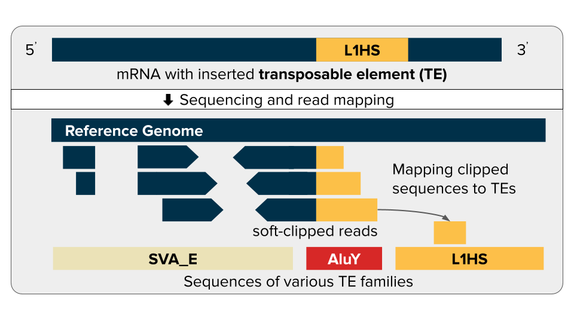

[](https://releases.ubuntu.com/18.04/)
[](https://cran.r-project.org/bin/windows/base/old/3.6.3/)
[](https://docs.docker.com/engine/release-notes/20.10/)
[](https://cloud.google.com/?hl=en)
[](https://www.biorxiv.org/content/10.1101/2023.10.16.562422v1.abstract)

# rTea (RNA Transposable Element Analyzer)

``rTea`` is a computational method to detect transposon-fusion RNA.


* Citation:[Pan-cancer analysis reveals multifaceted roles of retrotransposon-fusion RNAs](https://www.biorxiv.org/content/10.1101/2023.10.16.562422v1.abstract)

---

# Overview
we developed rTea to detect TE-fusion transcripts from short-read RNA-seq data. We utilized multiple features from aligned reads, such as base quality of clipped sequences, percentage of multi-mapped reads, and matching score of reads to TE sequences to filter out false positives caused by nonspecifically mapped reads.

# Demo and result files
Users can try rTea on a demo data set and can check the output at  [https://gitlab.aleelab.net/junseokpark/rtea-results](https://gitlab.aleelab.net/junseokpark/rtea-results)

# Installation
"rTea runs on a Linux-based operating system with certain prerequisite software. Here is a list of the software you should install before you start using rTea.

* System software for Ubuntu 18.04 LTS
```bash
apt-get update && apt-get install -y \
    cmake \
    libxml2-dev \
    libcurl4-openssl-dev \
    libboost-dev \
    gawk \
    libssl-dev \
    pigz \
    htop \
    iputils-ping
```

* Before installing rTea, you'll also need to set up the prerequisite software and environment variables (ENV).

  * [fastp]( http://opengene.org/fastp/fastp)
  * [HISAT2](http://opengene.org/fastp/fastp) (>= v2.1.0)
  * [samtools](https://github.com/samtools/samtools/releases/download/1.9/samtools-1.9.tar.bz2) (>= v1.9)
  * [HTSlib](https://github.com/samtools/htslib/releases/download/1.9/htslib-1.9.tar.bz2) (>= v1.9)
  * [Scallop](https://github.com/Kingsford-Group/scallop/releases/download/v0.10.4/scallop-0.10.4_linux_x86_64.tar.gz) (>= v0.10.4)
  * [bamtools](https://github.com/pezmaster31/bamtools/archive/v2.5.1.tar.gz) (>= v2.5.1)
  ```bash
  # Bamtools environment
  # BAMTOOL_HOME is installed directory
  PKG_CXXFLAGS="-I$BAMTOOL_HOME/include/bamtools"
  PKG_LIBS="-L$BAMTOOL_HOME/lib -lbamtools"
  ```
  * [bwa](https://github.com/lh3/bwa/releases/download/v0.7.17/bwa-0.7.17.tar.bz2) (>=0.7.17)

* [R](https://cran.r-project.org/) (==3.6.2) and the necessary R software should be installed.
```R
R -e "install.packages('XML', repos = 'http://www.omegahat.net/R')"
R -e "install.packages(c( \
       'magrittr', \
       'data.table', \
       'stringr', \
       'optparse', \
       'Rcpp', \
       'BiocManager' \
     ))"

R -e "BiocManager::install(c( \
       'GenomicAlignments', \
       'BSgenome.Hsapiens.UCSC.hg19', \
       'BSgenome.Hsapiens.UCSC.hg38', \
       'EnsDb.Hsapiens.v75', \
       'EnsDb.Hsapiens.v86' \
     ))"
```
* Download GRCh38 [genome_snp_tran](https://genome-idx.s3.amazonaws.com/hisat/grch38_snptran.tar.gz)


## Use Docker for Installation
Build a Docker file and run rTea in the Docker container.
```bash
DOCKER_BUILDKIT=1 docker build -t rTea .
```

## Use Singularity for Installation
After creating a Docker image for rTea, convert it to Singularity.

```bash
docker save -o rTea.tar rTea:latest
singularity build rTea.simg docker-archive://rTea.tar
```

---

# Running rTea
If you are using Docker as your runtime environment, run the Docker image to execute rTea.
```bash
docker exec -it -v ${GENOME_SNP_TRAN_DIR}:/app/rtea/hg38/genome_snp_tran rTea bash
```
If the runtime environment is Singularity, execute the Singularity image to run rTea.
```bash
singularity shell -B ${GENOME_SNP_TRAN_DIR}:/app/rtea/hg38/genome_snp_tran \
    rTea.simg
```

rTea supports paired-end FASTQ files and a BAM file as input.
For FASTQ file input, use the following command:
```bash
rtea.sh \
        ${R1.fq}.gz \
        ${R2.fq}.gz \
        $SAMPLE_NAME \
        $GENOME_SNP_TRAN_DIR \
        $NUMBER_OF_CORES \
        $OUT_DIR \
        hg38 \
        resume
```
For BAM file input, please use the following command:
```bash
rnatea_pipeline_from_bam \
        ${BAM} + \
        $SAMPLE_NAME \
        $GENOME_SNP_TRAN_DIR \
        $NUMBER_OF_CORES \
        $OUT_DIR \
        hg38
```

# Output file
After running rTea, the user can find a <SAMPLE_NAME>.rtea.txt file in the _rtea_ directory, which contains information about TEs and other supporting data.
|Column|Description|
|:---|:---|
|chr|Chromosome name|
|pos| Fusion breakpoint position on the chromosome
|ori| Fusion direction on the chromosome (f, TE|gene; r, gene|TE)
|class| TE class
|seq| Proximal portion of fusion sequence
|isPolyA| Whether it is a fusion with polyA sequence
|posRepFamily| Repeat masked repeat family on the breakpoint position
|posRep| Repeat maskec repeat element on the breakpoint position
|TEfamily| TE family with highest alingment score when fusion sequence is aligned with consensus TE sequence.
|TEscore| Alignment score of fusion sequence with the consensus TE sequence.
|TEside| Fusion direction on the consensus TE sequence (5, TE|gene; 3, gene|TE)
|TEbreak| Fusion breakpoint position on the consensus TE sequence.
|depth| Number of RNA-seq reads on the breakpoint position
|matchCnt| Number of fusion supporting RNA-seq reads.
|polyAcnt| Number of polyA reads
|baseQual| Median base quality of supporting reads.
|lowMapQual| Number of supporting reads that has low mapping quality
|mateDist| Minimum distance of mate reads
|overhang| Distance of breakpoint from splice site
|gap| Length of nearby intron
|secondary| Proportion supporting reads that is from secondary alignment
|nonspecificTE| Mean alignment score of supporting reads to consensus TE sequence
|r1pstrand| Proportion of supporting reads that is from positive strand of chromosome
|fusion_tx_id| Transcript ID of the fusion transcript
|tx_support_exon| Number of read fragments spanning exonic region of the fusion transcript ID
|tx_support_intron| Number of read gaps matching the fusion transcript ID
|strand| Strand of fusion transcript
|pos_type| Genomic region of breakpoint
|polyTE| Known non-reference TE on the breakpoint position
|hardstart| Start position of nearby reference genome where fusion sequence came from
|hardend| Start position of nearby reference genome where fusion sequence came from
|hardTE| Repeat masked TE subfamily of nearby reference genome where fusion sequence came from
|hardDist| Distance from fusion breakpoint to nearby reference genome where fusion sequence came from
|fusion_type| Type of TE fusion
|fusion_tx_biotype| Biotype of fusion transcript
|fusion_gene_id| Gene ID of fusion transcript
|fusion_gene_name| Gene symbol of fusion transcript
|Filter| Filter reason of low confidence fusion

# Licenses
[](https://opensource.org/licenses/MIT)
[](https://creativecommons.org/licenses/by-nc/4.0/)
